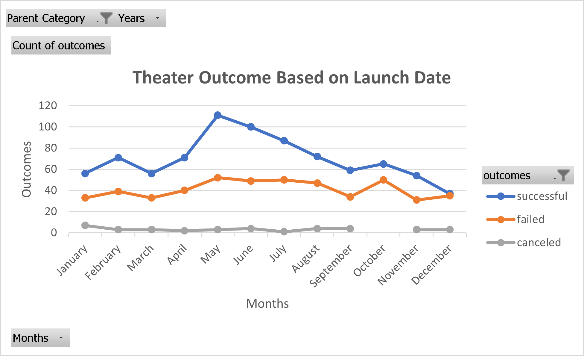
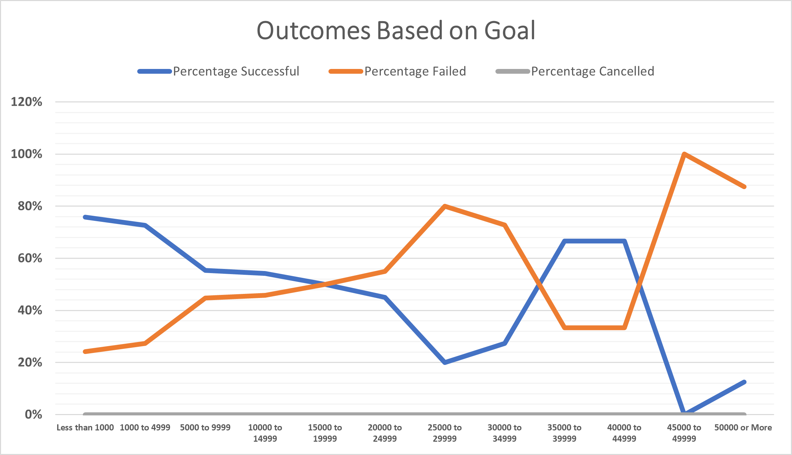

# kickstarter-analysis
Performing analysis on kickstarter data to uncover trends
# Overview of Project
In this section, you will find the background and purpose of the project.
### Background of Project
Lousie has a lot of interest in plays and has a plan to launch her play 'Fever' with a particular goal and launch date. She wants to analyse the past fundraising campaigns of various subcategories of film & videos using goal, outcome and launch date data of past years from 2009 to 2017 to make a decision about staging her play.  
### Purpose
This section contains main purpose of kickstarting project towards Louise.
#### Main Purpose
This project is designed to provide overview of outcomes based on goal and launch date of various fundraising subcatergory like television, art book, drama, plays etc under Film & video.By using excellent features of pivot table and charts, this project provides detailed analysis to Louise about past data of success & failure of fundraising events to set a particular goal and launch date of her campaign. 
## Analysis and Challenges
Past data covers theater and plays fundraising campaigns in various countries but does not necessarily targets particularity of it which make us assume taste, likes/dislikes, gender and age group of people in that country. It doesn't cover which part of country or what group of audience shown interest towards the campaign hence, analysis only focuses on entire population, not particular auidence which will be an obstacle towards achieving Louise's fundraising goal. Also kickstarter data ommits factors contributed towards the sucess, failure of goal. 
### Analysis of Outcomes Based on Launch Date 
##### Images showing Pivot table and chart
 

As per above pivot table and chart, most successful outcomes of theater campaign depending on their launch date has shown during the month of April to August for years from 2009 to 2017 and around 50 to 52 failed campaigns are resulted in month of May, July and October. 
### Analysis of Outcomes Based on Goals
##### Images showing Pivot table and chart

Above line chart shows relationship between range of goals of play campaign with percentage of successful, failed and canceled outcomes. Plays with a goals of less than $1000 has 80% success rate and around 100% failed outcome are resulted for plays with a goal set between $45000 to $49999.
### Challenges and Difficulties Encountered
  - One of the first challenge encountered was with year() function. I took a help of ASK BCS and BCS assistant has explained me the function with proper explanation. 
  - Another challenge was with README file and basic syntax to use while editing the file. Reference provided in canvas and ASK BCS was a life saver in it, i did encountered some issues after i uploaded README in Git Hub and while committing the changes but at the end with practise it was solved. 
## Results
This section contains results based on detailed analysis of kickstarter data. 
- What are two conclusions you can draw about the Outcomes based on Launch Date?
Data analysis based on outcomes of launch date discovers that May to July is the best time for launching fundraising campaign. From April, graph has shown the upward movement of successful outcomes and reached the peak in May, After the month of May, line graph shown consistency of being in top 20 rate of outcomes till July. Most successful outcomes from 2009 to 2017 has landed in the month of May which Louise can take into consideration for *Fever* campaign. 
- What can you conclude about the Outcomes based on Goals?
Looking at historical success percentage data, around 70% to 80% successful outcomes has a goal less than $5000. Also campaigns with a goal less than $5000 has shown lowest failure rate in past years which make this an ideal goal for Louise success in campaign. 
- What are some limitations of this dataset?
This data covers the entire populations and does not narrow down the analysis to focus particular target audience. Also data does not include other details which would have provided highest success rate to Louise in his campaign like know your audience, promotions or advertising data, factors towards success/failure.
- What are some other possible tables and/or graphs that we could create?
Creating tables based on outcomes of launch date or goal of different countries would have helped Louise understanding behaviour of people in various parts of world. Also charts showing detailed analysis would have helped to make stratgies or plans to become successful. 
